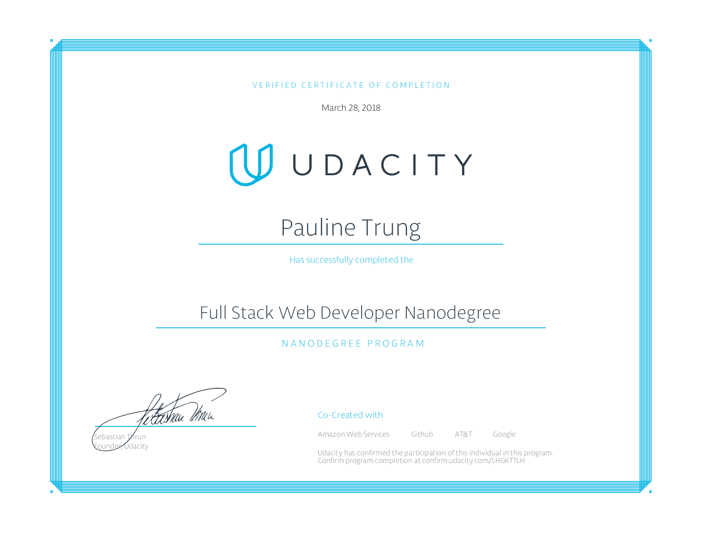

# Udacity Nanodegree "Full Stack Web Developer"
This repository is a collection of all projects I implemented during the Udacity Nanodegree "Full Stack Web Developer". Each project is stored in a seperate folder. Current versions of the projects can be found in the original repositories. (Links below) 

## Projects 
1. Movie Trailer Website (https://github.com/ptrung/Trailer-Website)
2. Portfolio Site (https://github.com/ptrung/Portfolio-Site)
3. Logs Analysis Project (https://github.com/ptrung/Log-Analysis)
4. Item Catalog Application (https://github.com/ptrung/Item-Catalog)
5. Neighborhood Map (https://github.com/ptrung/Neighborhood-Map)
6. Linux Server Configuration (https://github.com/ptrung/Linux-Server-Configuration)

## Courses
1. Programming Fundamentals and the Web
    - Programming Foundations with Python
    - Responsive Web Design Fundamentals
2. Developers' Tools
    - Shell Workshop
    - Version Control with Git
    - Github Collaboration
    - HTTP Web Servers
3. The Backend: Databases & Applications
    - Intro to Relational Databases
    - Full Stack Foundations
    - Authentication and Authorization: OAuth
    - Designing RESTful APIs
4. The Frontend: Javascript & AJAX
    - Intro to AJAX
    - Javascript Design Patterns
    - Google Maps APIs
5. Deploying to Linux Servers
    - Configuring Linux Web Servers
